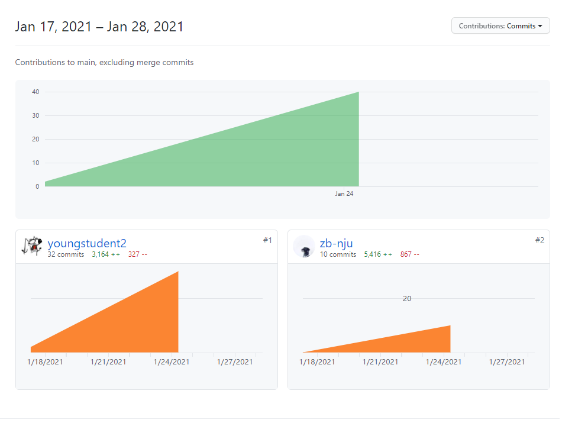

# Date10 -- 轻量级约会参考及记录软件

作者： 181860055 刘国涛 & 181860106 王梓博

## 1.灵感介绍

我们希望开发一款恋爱 APP，可以在挑选约会地点时自动排雷。比如在搜索烤肉店的时候，能够提示“第一次约会慎去”，并提醒你，某些店的浓重油烟会摧毁你们的约会氛围；当你搜索某家网红咖啡厅时，会提醒你“不适合与心动的 ta 去“，因为来往的人和高举的手机，会见你攒了很多勇气的话全部堵回去。

## 2.技术实现

* 通过爬取美团、大众点评等平台的评论作为训练数据，利用 coreML 进行训练，用得到的模型对评论信息进行预测，得到相应的结果
* APP 为利用 storyboad 开发的多页面应用，每个页面的设计详情见 [Date10 设计文档](design.md)

## 3.亮点

数据结构设计balabala

## 4.不足

由于时间较为紧迫，因此 APP 的实现较为粗糙，只处于能运行的状态，仍有许多地方能够有更好更完美的实现

## 5.合作分工

* 刘国涛负责页面的设计及底层数据结构的设计与实现，王梓博负责用 storyboard 绘制相应的页面

* 两人共同完成页面中数据的接入、及其余代码的实现，此部分无明显分工

* 

  根据 GitHub 记录，两人代码量均远超2000行

## 6.鸣谢

* 感谢曹春老师、徐经纬老师及助教一学期的教诲
* GXBanner：https://github.com/gsyhei/GXBanner
* SJImagePickerViewController：https://github.com/SJ-Lyran/SJImagePickerViewController

